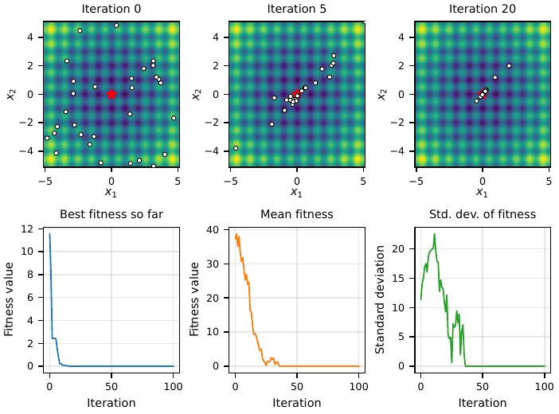
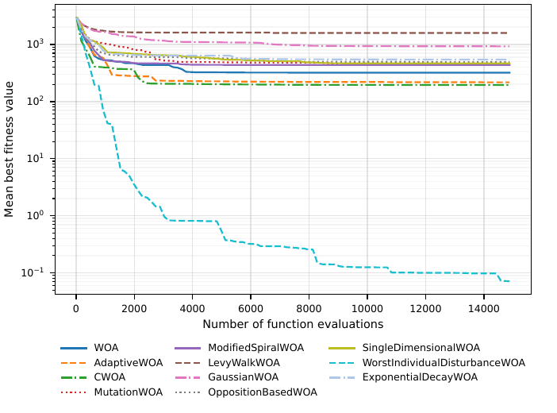

Examples
========

The ``examples`` directory of the repository contains a usage example for every variant
(they are also shown on the API pages) and the scripts described below. All examples can be
run directly from the repository, e.g.::

   python examples/example_01_basic_woa.py

Custom objective function
-------------------------

Any Python function that takes a list of decision variables and returns a number can be
used as the objective function.

.. literalinclude:: ../examples/example_02_custom_function.py
   :language: python
   :start-at: from whalepy import

Maximization
------------

By default, the objective function is minimized. To maximize it, set
``optimization_type``:

.. code-block:: python

   from whalepy import OptimizationType, WOA, WOAData

   def objective(x):
       return -((x[0] - 1.0) ** 2 + (x[1] + 2.0) ** 2)

   config = WOAData(
       dimension=2,
       lb=[-5.0],
       ub=[5.0],
       function=objective,
       optimization_type=OptimizationType.MAXIMIZATION,
       seed=1,
   )
   result = WOA(config).run()
   print(result.best_fitness_value, result.best_whale.position)

Stopping the run early
----------------------

A :class:`~whalepy.models.stop_condition.LambdaStopCondition` is called after the
initialization and after each iteration. In the example below, the run stops as soon as
the required accuracy is reached:

.. code-block:: python

   from whalepy import CWOA, CWOAData, FunctionLoader
   from whalepy.models.stop_condition import LambdaStopCondition

   config = CWOAData(
       dimension=10,
       lb=[-5.12],
       ub=[5.12],
       function=FunctionLoader().load_callable("rastrigin"),
       max_iter=1000,
       seed=1,
       stop_condition=LambdaStopCondition(lambda algorithm, best: best.fitness_value < 1e-8),
   )
   result = CWOA(config).run()
   print(result.epochs_completed, result.nfe, result.best_fitness_value)

Boundary handling
-----------------

When a whale leaves the search space, its position is repaired with the method given in
``boundary_constraints_fun``. Besides the built-in strategies
(:class:`~whalepy.BoundaryConstraint`), a user-defined function can be used:

.. code-block:: python

   from whalepy import BoundaryConstraint, FunctionLoader, WOA, WOAData

   sphere = FunctionLoader().load_callable("sphere")

   config = WOAData(dimension=5, lb=[-5.0], ub=[5.0], function=sphere,
                    boundary_constraints_fun=BoundaryConstraint.REFLECT, seed=3)
   print(WOA(config).run().best_fitness_value)

   def my_repair(candidate, lb, ub):
       return [min(max(value, low), high) for value, low, high in zip(candidate, lb, ub)]

   config = WOAData(dimension=5, lb=[-5.0], ub=[5.0], function=sphere,
                    boundary_constraints_fun=my_repair, seed=3)
   print(WOA(config).run().best_fitness_value)

Tracking the optimization process
---------------------------------

``examples/example_13_rastrigin_convergence.py`` runs WOA on the two-dimensional Rastrigin
function and records the state of the population after every iteration with a
:class:`~whalepy.models.stop_condition.LambdaStopCondition`. The core of the script:

.. code-block:: python

   from whalepy import WOA, WOAData, FunctionLoader
   from whalepy.models.stop_condition import LambdaStopCondition

   rastrigin = FunctionLoader().load_callable("rastrigin")
   log = []

   def record(algorithm, best_whale):
       population = algorithm.population
       log.append({"iteration": algorithm.current_epoch,
                   "best": best_whale.fitness_value,
                   "mean": population.mean_fitness(),
                   "std": population.std_fitness()})
       return False

   config = WOAData(population_size=30, max_iter=100, dimension=2,
                    lb=[-5.12, -5.12], ub=[5.12, 5.12],
                    function=rastrigin, seed=42,
                    stop_condition=LambdaStopCondition(record))
   result = WOA(config).run()
   print(result.best_fitness_value, result.best_whale.position)

The script saves the figure below (it requires ``matplotlib`` and ``numpy``). The top row
shows the positions of the whales at iterations 0, 5, and 20; the bottom row shows the best
fitness value found so far and the mean and standard deviation of the fitness values in the
population.

Comparing variants
------------------

``examples/example_14_variants_comparison.py`` runs all variants with their default
parameters on the 10-dimensional Schwefel function (population of 30 whales, 15,000
function evaluations, 10 runs with seeds from 1 to 10). Since all variants share the same
interface, only the algorithm class and its configuration class change:

.. code-block:: python

   for algorithm_cls, config_cls in [(WOA, WOAData),
                                     (CWOA, CWOAData),
                                     (GaussianWOA, GaussianWOAData)]:
       config = config_cls(population_size=30, max_iter=None,
                           max_nfe=15000, dimension=10,
                           lb=[-500.0] * 10, ub=[500.0] * 10,
                           function=schwefel, seed=1)
       result = algorithm_cls(config).run()

The script saves the mean convergence curves and a CSV file with the convergence data of
every run. The curves are plotted against the number of function evaluations, because
some variants evaluate more candidate solutions per iteration than others.

The ranking of the variants depends on the problem, so such a comparison should be
repeated for the problem of interest.

Benchmark runner
----------------

``benchmarks/benchmark_runner.py`` runs all variants on eight built-in benchmark functions
(all except Sphere) over multiple independent runs, prints summary statistics (best, mean,
and standard deviation of the final fitness values, average time, iterations, and function
evaluations), and can save the result of every run to a CSV file::

   python benchmarks/benchmark_runner.py --csv results.csv

Available options:

- ``--dimension`` -- number of decision variables (default 10),
- ``--population-size`` -- number of whales (default 30),
- ``--max-iter`` -- maximum number of iterations (default 120),
- ``--max-nfe`` -- maximum number of function evaluations (default 5000),
- ``--runs`` -- number of independent runs (default 3),
- ``--seed`` -- seed of the first run; the following runs use consecutive seeds (default 7),
- ``--csv`` -- path of the CSV file with the results of every run,
- ``--smoke`` -- a small and fast configuration for a quick check.
